# Homelab Documentation
**Project:** Windows Active Directory Lab  
**Author:** Stanley Kafuko  
**GitHub:** https://github.com/kstanl/homelab-ad  
**Started:**  January 2026  
**Status:** In Progress

---

## Objective

Build a functional home lab environment using VirtualBox to demonstrate Active Directory, DNS, DHCP, user authentication, Group Policy, PowerShell scripting, and Linux file server skills relevant to the Fachinformatiker Systemintegration (FiSi) Ausbildung.

---

## Host Machine Specifications

| Property | Detail |
|---|---|
| Device Name | Kstan |
| Processor | AMD Ryzen 7 7730U with Radeon Graphics (2.00 GHz) |
| RAM | 16 GB (13.8 GB usable) |
| Storage | 953 GB total / 668 GB free |
| OS | Windows 11 Pro (Version 25H2, Build 26200.8246) |
| VirtualBox Version | 7.2.6 r172322 |

---

## Pre-Configuration Steps

### Hyper-V Disabled
Hyper-V Hypervisor was disabled to give VirtualBox direct hardware access and avoid virtualization conflicts.

**Problem encountered:** VirtualBox VMs were running slowly and unstably because Hyper-V was occupying hardware virtualization extensions.

**Solution:** Disabled the Hyper-V Hypervisor via PowerShell:

```powershell
bcdedit /set hypervisorlaunchtype off
Disable-WindowsOptionalFeature -Online -FeatureName Microsoft-Hyper-V-Hypervisor -NoRestart
```

**Result:** `Microsoft-Hyper-V-Hypervisor` → Disabled.

>  **Screenshot:** PowerShell output showing Hyper-V Hypervisor = Disabled
> 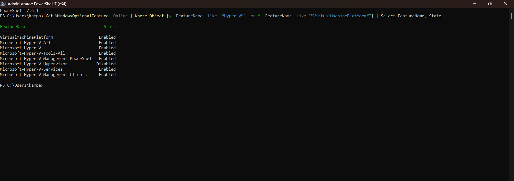
---

### Folder Structure Created
```
C:\Homelab\
├── ISOs\
├── VMs\
└── Docs\
```

**Command used:**
```powershell
New-Item -ItemType Directory -Path "C:\Homelab\ISOs", "C:\Homelab\VMs", "C:\Homelab\Docs"
```

**Problem encountered:** Running `mkdir` with multiple paths in PowerShell 7 returned an error.

**Solution:** Used `New-Item` instead.

VirtualBox Default Machine Folder set to: `C:\Homelab\VMs`

>  **Screenshot:** File Explorer showing C:\Homelab folder structure
> 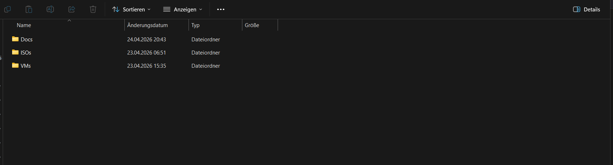

---

### ISOs Downloaded
| File | Purpose |
|---|---|
| `SERVER_EVAL_x64FRE_en-us.iso` | Windows Server 2022 Evaluation (180-day) |
| `ubuntu-24.04.4-live-server-amd64.iso` | Ubuntu Server 24.04 LTS |

Stored in: `C:\Homelab\ISOs\`

---

## Virtual Machine: WinServer (DC01)

### VM Configuration

| Setting | Value |
|---|---|
| VM Name | WinServer |
| OS | Windows Server 2022 Standard Evaluation (Desktop Experience) |
| RAM | 2048 MB (2 GB) |
| CPUs | 2 |
| Storage | 50 GB VDI (Dynamically allocated) |
| Network Adapter | Internal Network — `LabNet` |

>  **Screenshot:** VirtualBox WinServer settings — Network tab showing Internal Network / LabNet
> 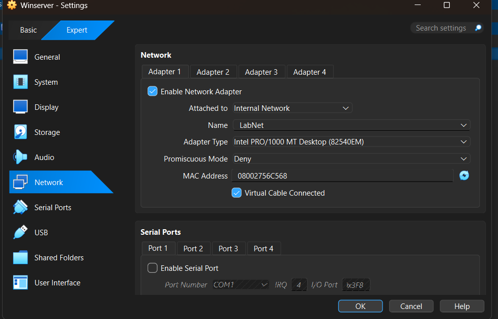

---

### Installation Steps

1. Created VM in VirtualBox with above specifications
2. Attached `SERVER_EVAL_x64FRE_en-us.iso` to SATA controller
3. Selected **Custom Install** during Windows Setup
4. Installed to Drive 0 Unallocated Space (50 GB)
5. Set Administrator password
6. Installation completed successfully

**Problem encountered:** VirtualBox auto-attached an unattended UUID ISO instead of the correct ISO.

**Solution:** Manually removed wrong ISO and attached `SERVER_EVAL_x64FRE_en-us.iso`.

**Problem encountered:** Selected "Active Directory Certificate Services" instead of "Active Directory Domain Services."

**Solution:** Removed wrong role, installed correct AD DS role.

>  **Screenshot:** Windows Server 2022 Setup — edition selection (Desktop Experience)
> [Screenshot not available — taken during installation]

**Snapshot taken:** `Fresh Install - No Config`

---

### Post-Installation Configuration

#### 1. Renamed Server
- Renamed to `DC01` and rebooted

#### 2. Static IP Address

| Field | Value |
|---|---|
| IP Address | 192.168.1.1 |
| Subnet Mask | 255.255.255.0 |
| Default Gateway | (blank) |
| Preferred DNS | 127.0.0.1 |

> **Screenshot:** IPv4 Properties showing static IP on DC01
> 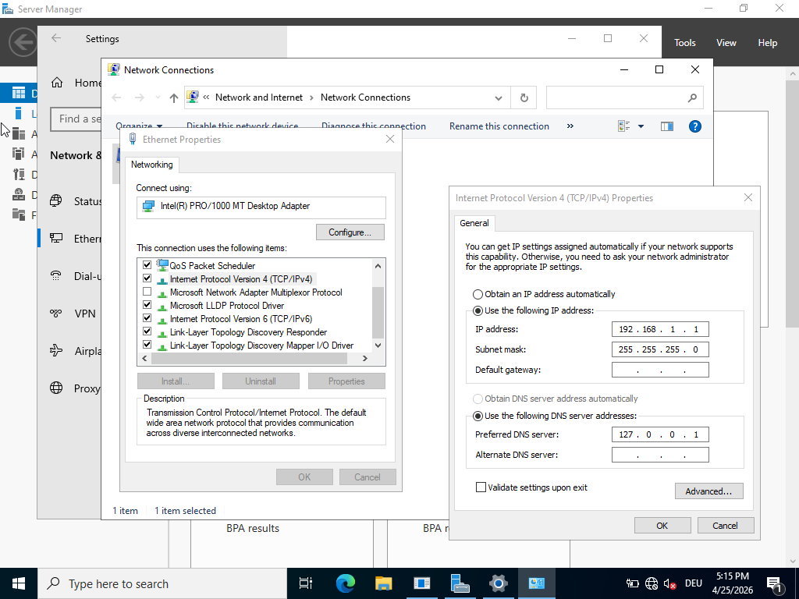

---

### Active Directory Domain Services (AD DS)

#### Installation
- Role: **Active Directory Domain Services**
- Installation succeeded on DC01

#### Promotion to Domain Controller
- New forest: `lab.local`
- NetBIOS: `LAB`
- Forest/Domain Functional Level: Windows Server 2016
- DNS Server: Yes
- Global Catalog: Yes
- DSRM password set

>  **Screenshot:** Review Options screen showing lab.local settings
> 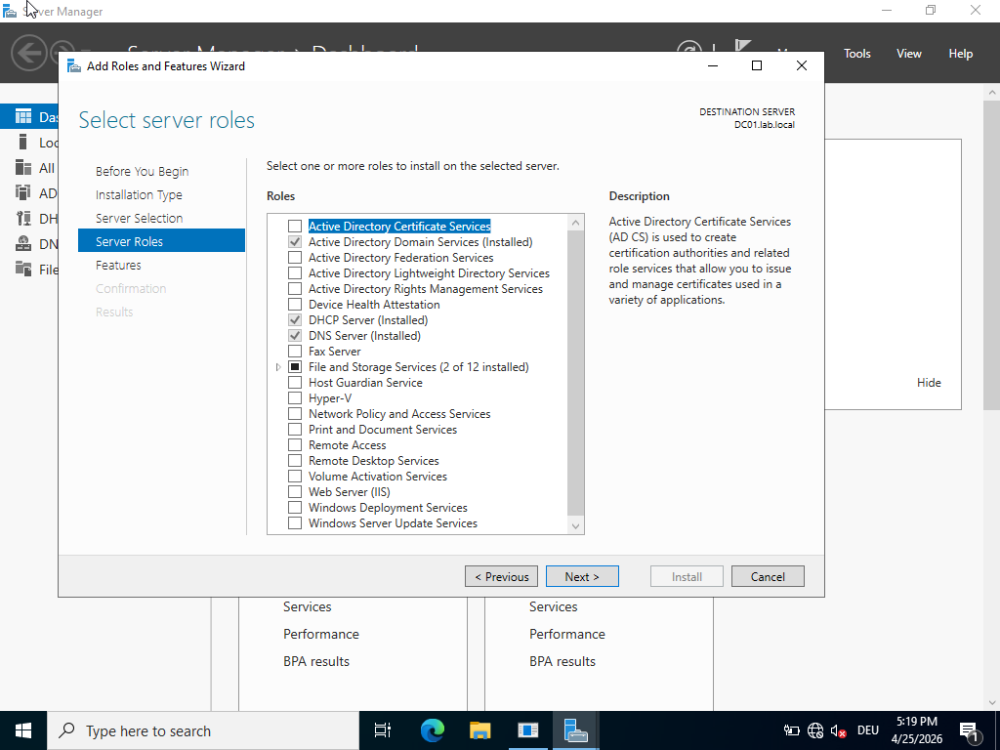


>  **Screenshot:** Server Manager showing AD DS and DNS roles (green)
> 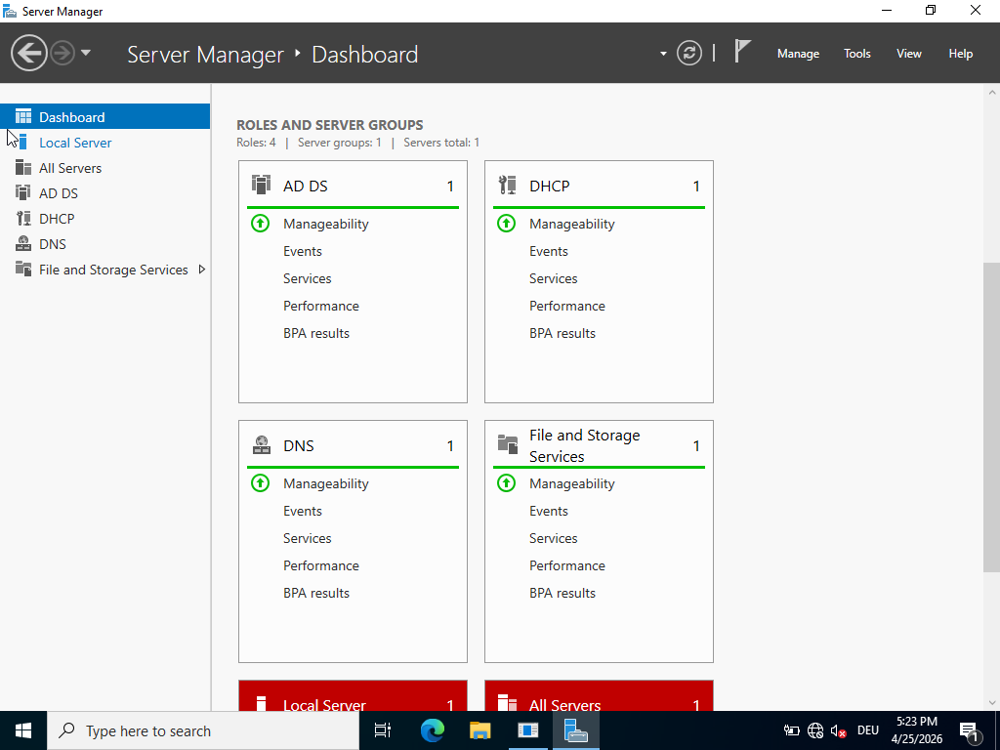
**Snapshot taken:** `DC01 - AD DS Complete`

---

### DNS
- Installed automatically with AD DS
- Running and healthy
- Resolves within `lab.local`

---

### Active Directory Users

| Full Name | Logon Name | Password |
|---|---|---|
| John Doe | jdoe | User@12345 |
| Jane Doe | jadoe | User@12345 |

- Password never expires: Yes
- Must change at next logon: No

>  **Screenshot:** AD Users and Computers showing jdoe and jadoe
> 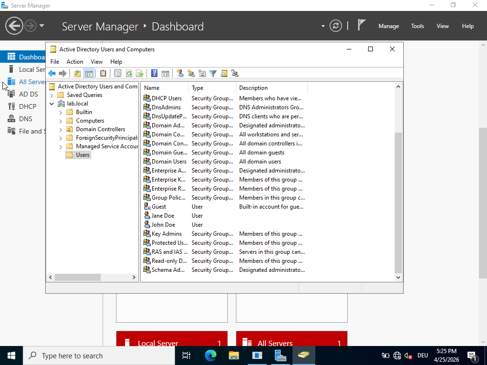

---

### DHCP Server

- Scope name: `LabScope`
- IP Range: `192.168.1.100` – `192.168.1.200`
- Subnet Mask: `255.255.255.0`
- Gateway: `192.168.1.1`
- DNS: `192.168.1.1`

>  **Screenshot:** DHCP Manager showing LabScope
> 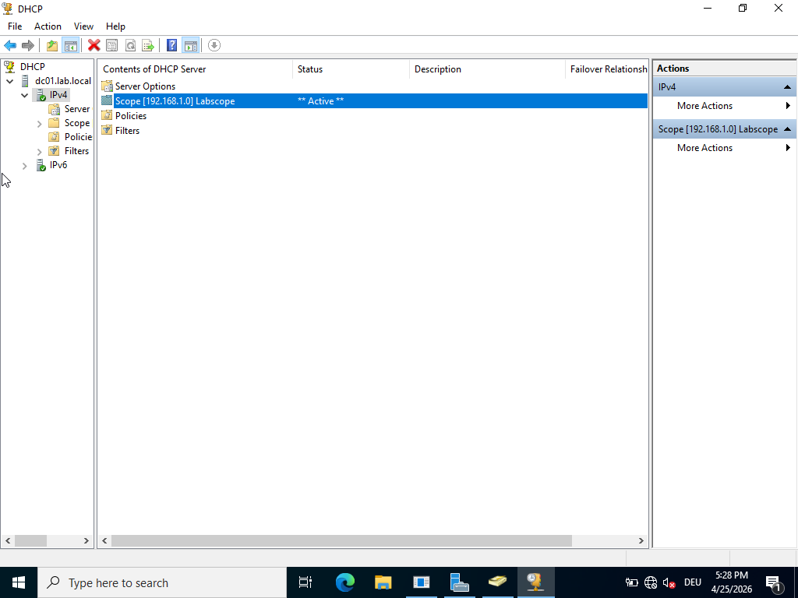

**Snapshot taken:** `DC01 - DHCP Complete`

---

### Group Policy (GPO)

Created and linked a **Password Policy** GPO to `lab.local`:

| Setting | Value |
|---|---|
| Minimum password length | 8 characters |
| Password must meet complexity requirements | Enabled |
| Maximum password age | 90 days |
| Minimum password age | 1 day (suggested by wizard) |

Steps taken:
1. Opened Group Policy Management via Server Manager → Tools
2. Expanded Forest: lab.local → Domains → lab.local → Group Policy Objects
3. Right-clicked Group Policy Objects → New → named `Password Policy`
4. Right-clicked Password Policy → Edit
5. Navigated to: Computer Configuration → Policies → Windows Settings → Security Settings → Account Policies → Password Policy
6. Configured all four settings above
7. Closed editor, right-clicked lab.local → Link an Existing GPO → selected Password Policy

>  **Screenshot:** Group Policy Management showing Password Policy linked to lab.local
> 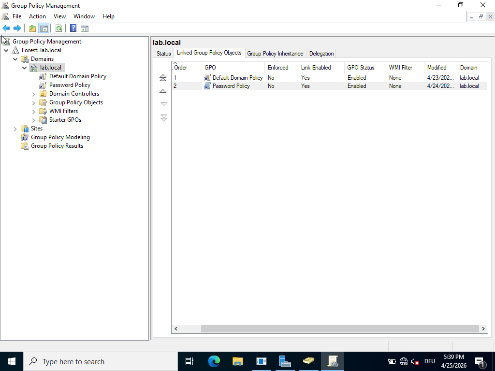
>  **Screenshot:** Password Policy settings in Group Policy Management Editor
> 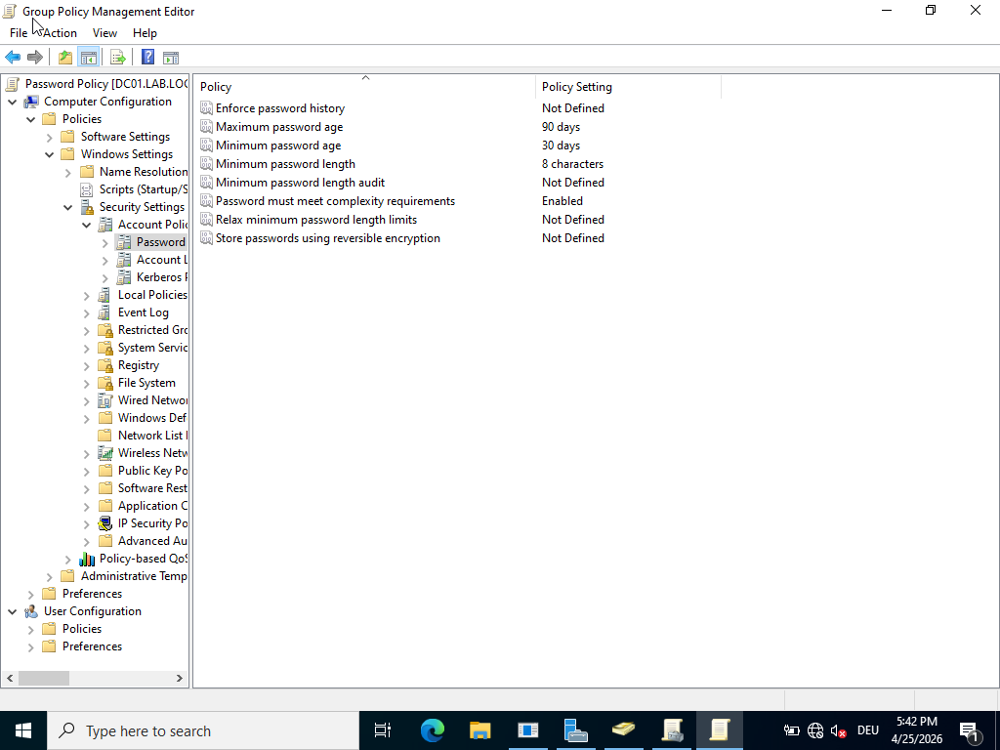

**Snapshot taken:** `DC01 - Password Policy GPO`

---

### PowerShell User Provisioning Script

Created `C:\users.csv` with user data:

```csv
FirstName,LastName,Username,Password
Alice,Müller,amueller,User@123456
Bob,Schmidt,bschmidt,User@123456
Clara,Weber,cweber,User@123456
```

Created `C:\CreateUsers.ps1` to provision AD users from CSV:

```powershell
Import-Csv "C:\users.csv" | ForEach-Object {
    $password = ConvertTo-SecureString $_.Password -AsPlainText -Force
    New-ADUser `
        -Name "$($_.FirstName) $($_.LastName)" `
        -GivenName $_.FirstName `
        -Surname $_.LastName `
        -SamAccountName $_.Username `
        -UserPrincipalName "$($_.Username)@lab.local" `
        -AccountPassword $password `
        -Enabled $true `
        -PasswordNeverExpires $true
    Write-Host "Created user: $($_.Username)"
}
```

**Problem encountered:** German keyboard layout (QWERTZ) corrupted `$` characters when typing in Notepad inside the VM, causing `$($_.Username)` to render as `$(ÂS_.Username)`.

**Solution:** Rewrote the script using PowerShell here-string syntax to avoid clipboard/keyboard encoding issues.

**Execution policy set:**
```powershell
Set-ExecutionPolicy RemoteSigned -Force
```

> 📷 **Screenshot:** PowerShell output showing "Created user: amueller / bschmidt / cweber"
> 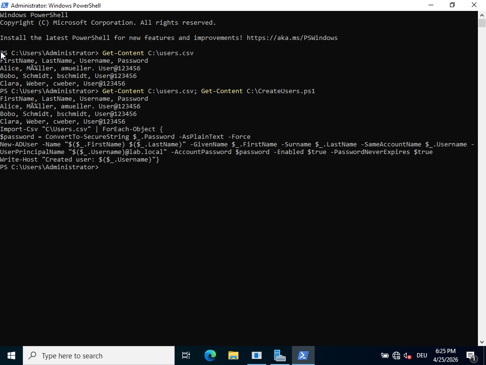

---

## Virtual Machine: WinClient

### VM Configuration

| Setting | Value |
|---|---|
| VM Name | WinClient |
| OS | Windows 11 Enterprise Evaluation (64-bit) |
| RAM | 4096 MB (4 GB) |
| CPUs | 2 |
| Storage | 55 GB VDI (Dynamically allocated) |
| Network Adapter | Internal Network — `LabNet` |
| TPM | 2.0 |
| Secure Boot | Enabled (UEFI) |
| Video Memory | 128 MB |

> 📷 **Screenshot:** VirtualBox WinClient settings — System tab showing TPM 2.0, UEFI, Secure Boot
> `[Insert screenshot here]`

---

### Installation Steps

**Problem encountered:** VM configured as 32-bit by default (boot error 0xc000035a).

**Solution:** Changed to Windows 11 (64-bit) in VM General settings.

**Problem encountered:** Windows 11 rejected disk — no TPM 2.0, RAM < 4 GB, no Secure Boot.

**Solution:** Enabled UEFI, TPM 2.0, Secure Boot; reset Secure Boot Keys; increased RAM to 4096 MB.

**Problem encountered:** Disk too small (50 GB < 52 GB Windows 11 minimum).

**Solution:**
```powershell
& "C:\Program Files\Oracle\VirtualBox\VBoxManage.exe" modifyhd "C:\Homelab\VMs\WinClient\WinClient.vdi" --resize 55000
```

**Problem encountered:** No Ethernet adapter visible after installation.

**Solution:** Installed VirtualBox Guest Additions; changed adapter type to Intel PRO/1000 MT Desktop.

> 📷 **Screenshot:** Windows 11 desktop after installation
> `[Insert screenshot here]`

**Snapshot taken:** `WinClient - Fresh Install`

---

### Network Configuration

| Field | Value |
|---|---|
| IP Address | 192.168.1.101 |
| Subnet Mask | 255.255.255.0 |
| Default Gateway | 192.168.1.1 |
| Preferred DNS | 192.168.1.1 |

---

### Domain Join

**Problem encountered:** Domain join failed — "DC for lab.local could not be contacted."

**Solution:** Set DNS to 192.168.1.1 (DC01). Domain join succeeded immediately after.

>  **Screenshot:** "Welcome to the lab.local domain" message
> [Screenshot not available — taken during domain join process]

---

### Domain User Login Test

- Username: `LAB\jdoe` / Password: `User@12345`
- Login successful ✅

>  **Screenshot:** WinClient desktop logged in as LAB\jdoe
> 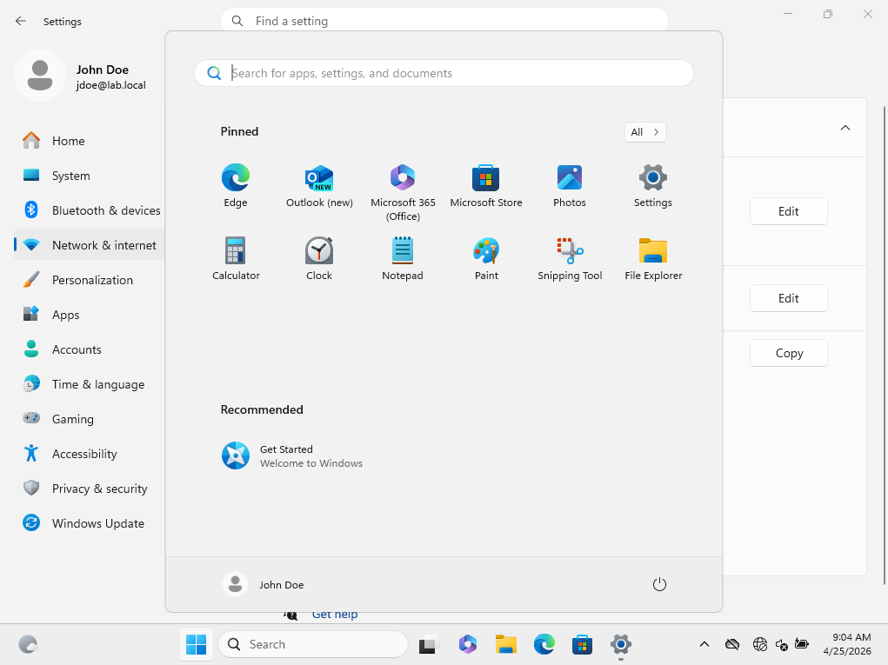

**Snapshot taken:** `WinClient - Domain Joined`

---

## Virtual Machine: UbuntuServer

### VM Configuration

| Setting | Value |
|---|---|
| VM Name | ubuntuserver22.04 |
| OS | Ubuntu Server 24.04.4 LTS (64-bit) |
| RAM | 1024 MB (1 GB) |
| CPUs | 1 |
| Storage | 20 GB VDI (Dynamically allocated) |
| Network Adapter | Internal Network — `LabNet` |
| Login | stanley / 26181184 |

---

### Installation

**Problem encountered:** First two attempts used unattended install — crashed due to no internet on LabNet.

**Solution:** Unchecked "Proceed with Unattended Installation" — forced manual installer, set credentials manually.

**Problem encountered:** Second VM had disk I/O errors and filesystem corruption.

**Solution:** Deleted corrupted VM, created fresh one.

**Problem encountered:** German keyboard layout prevented typing `/`, `[`, `]`, `:` in Ubuntu.

**Solution:** Ran `sudo loadkeys de` each session.

**Snapshot taken:** `UbuntuServer - Fresh Install`

---

### Static IP Configuration

Configured via `/etc/systemd/network/10-enp0s3.network`:

```ini
[Match]
Name=enp0s3

[Network]
Address=192.168.1.50/24
DNS=192.168.1.1
```

**Problem encountered:** Netplan config not applied after reboot — interface stayed DOWN.

**Root cause:** `/etc/netplan` directory was manually created and not in the correct state; netplan debug showed empty merged config.

**Solution:** Bypassed netplan entirely and used systemd-networkd directly with a `.network` file. Static IP persists across reboots.

**Verified:** `ping 192.168.1.1` from UbuntuServer → DC01 replies confirmed ✅

>  **Screenshot:** ip a showing 192.168.1.50/24 on enp0s3
> 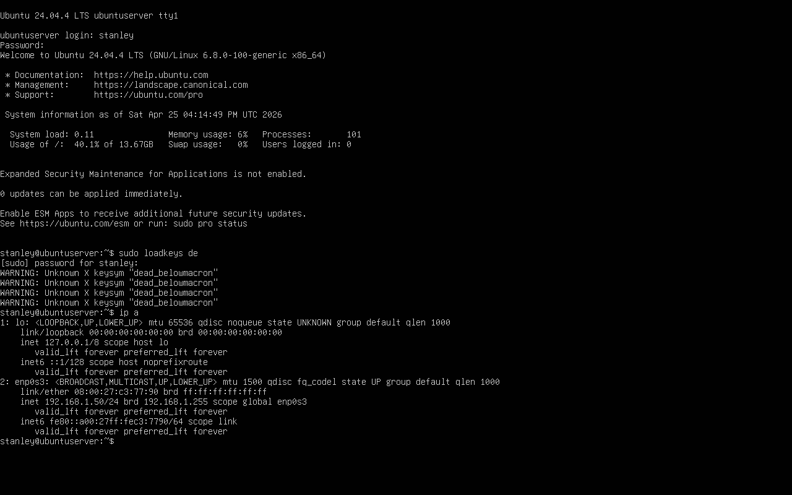

>  **Screenshot:** ping 192.168.1.1 showing successful replies
> 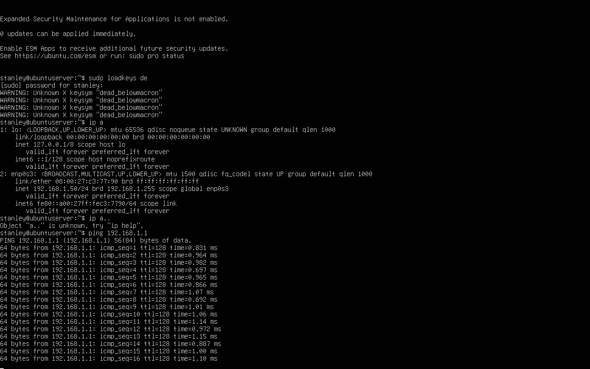

**Snapshot taken:** `UbuntuServer - Static IP Complete`

---

## Current Lab Status

| Component | Status |
|---|---|
| VirtualBox Host (Hyper-V off) | ✅ Complete |
| WinServer VM + Windows Server 2022 | ✅ Complete |
| DC01 — AD DS, DNS, DHCP | ✅ Complete |
| AD Users (jdoe, jadoe) | ✅ Complete |
| WinClient — Windows 11, domain joined | ✅ Complete |
| Domain user login verified | ✅ Complete |
| Password Policy GPO | ✅ Complete |
| PowerShell user provisioning script | ✅ Complete |
| UbuntuServer — Ubuntu 24.04 installed | ✅ Complete |
| UbuntuServer static IP (192.168.1.50) | ✅ Complete |
| Connectivity verified (ping DC01) | ✅ Complete |
| GitHub repository | ✅ Created |
| Samba File Server (Ubuntu) | 🔲 Pending |
| Documentation uploaded to GitHub | 🔲 Pending |
| Screenshots added to documentation | 🔲 Pending |

---

## Next Steps

1. Upload this documentation to GitHub
2. Add screenshots to all placeholder sections
3. Install and configure Samba on UbuntuServer as domain member file server
4. Update CV with GitHub link

---

## Network Plan

| Device | IP Address | Role |
|---|---|---|
| DC01 (WinServer) | 192.168.1.1 | Domain Controller, DNS, DHCP |
| WinClient | 192.168.1.101 | Domain-joined Windows 11 client |
| UbuntuServer | 192.168.1.50 | File server (Samba, pending) |

All VMs on VirtualBox **Internal Network: LabNet**

---

## Full Troubleshooting Log

| # | Problem | Cause | Solution |
|---|---|---|---|
| 1 | VMs slow/unstable | Hyper-V Hypervisor conflicting with VirtualBox | Disabled via bcdedit + PowerShell |
| 2 | `mkdir` failed with multiple paths | PowerShell 7 syntax difference | Used `New-Item` cmdlet |
| 3 | Wrong ISO auto-attached | VirtualBox unattended ISO attached by default | Manually replaced with correct ISO |
| 4 | Wrong AD role installed | AD Certificate Services vs AD Domain Services confusion | Removed wrong role, installed AD DS |
| 5 | WinClient 32-bit boot error | VM defaulted to 32-bit OS | Changed to Windows 11 (64-bit) |
| 6 | TPM/Secure Boot/RAM errors | UEFI not enabled, TPM not set, RAM too low | Enabled UEFI, TPM 2.0, Secure Boot; RAM to 4 GB |
| 7 | Shift+F10 not working | German keyboard layout on laptop | Used Create Partition button in installer instead |
| 8 | Disk too small for Windows 11 | 50 GB below 52 GB minimum | Resized to 55 GB using VBoxManage |
| 9 | VBoxManage not in PATH | VirtualBox not added to system PATH | Used full executable path |
| 10 | No Ethernet adapter in WinClient | Guest Additions not installed | Installed Guest Additions; fixed adapter type |
| 11 | Domain join failed | DNS not pointing to DC01 | Set static IP with DNS = 192.168.1.1 |
| 12 | Ubuntu unattended install crashed | No internet; installer tried to fetch packages | Unchecked unattended install option |
| 13 | Ubuntu disk I/O errors | VDI corruption | Deleted VM, created fresh one |
| 14 | Can't type `/` `[` `]` in Ubuntu | German QWERTZ keyboard, English layout active | `sudo loadkeys de` each session |
| 15 | Netplan not applying static IP | Manually created netplan dir not working; empty merged config | Switched to systemd-networkd `.network` file |
| 16 | Ubuntu login failed initially | Unattended install set unknown credentials | Used manual installer to set known credentials |
| 17 | `$` character corrupted in scripts | German keyboard encoding in VM | Rewrote script using PowerShell here-string |
| 18 | `ConvertTo-SecureString` not found | Script ran without valid `$password` variable | Fixed script character encoding |
